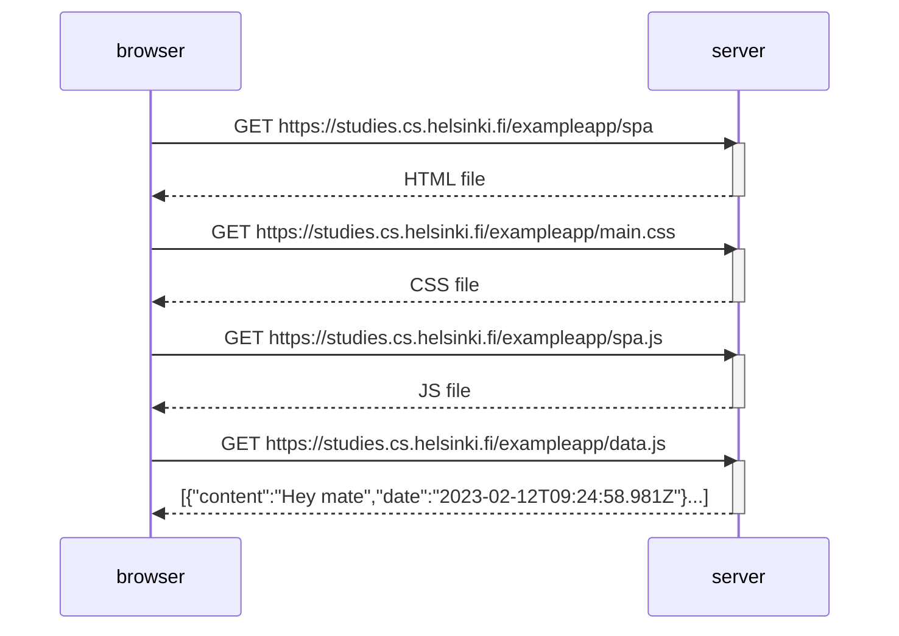

```mermaid
sequenceDiagram
    participant browser
    participant server
    
    
    browser->>server: GET https://studies.cs.helsinki.fi/exampleapp/spa
    activate server
    server-->>browser: HTML file
    deactivate server
    

    browser->>server: GET https://studies.cs.helsinki.fi/exampleapp/main.css
    activate server
    server-->>browser: CSS file
    deactivate server

    browser->>server: GET https://studies.cs.helsinki.fi/exampleapp/spa.js
    activate server
    server-->>browser: JS file
    deactivate server
    
    browser->>server: GET https://studies.cs.helsinki.fi/exampleapp/data.js
    activate server
    server-->>browser: [{"content":"Hey mate","date":"2023-02-12T09:24:58.981Z"}...]
    deactivate server
    
```
